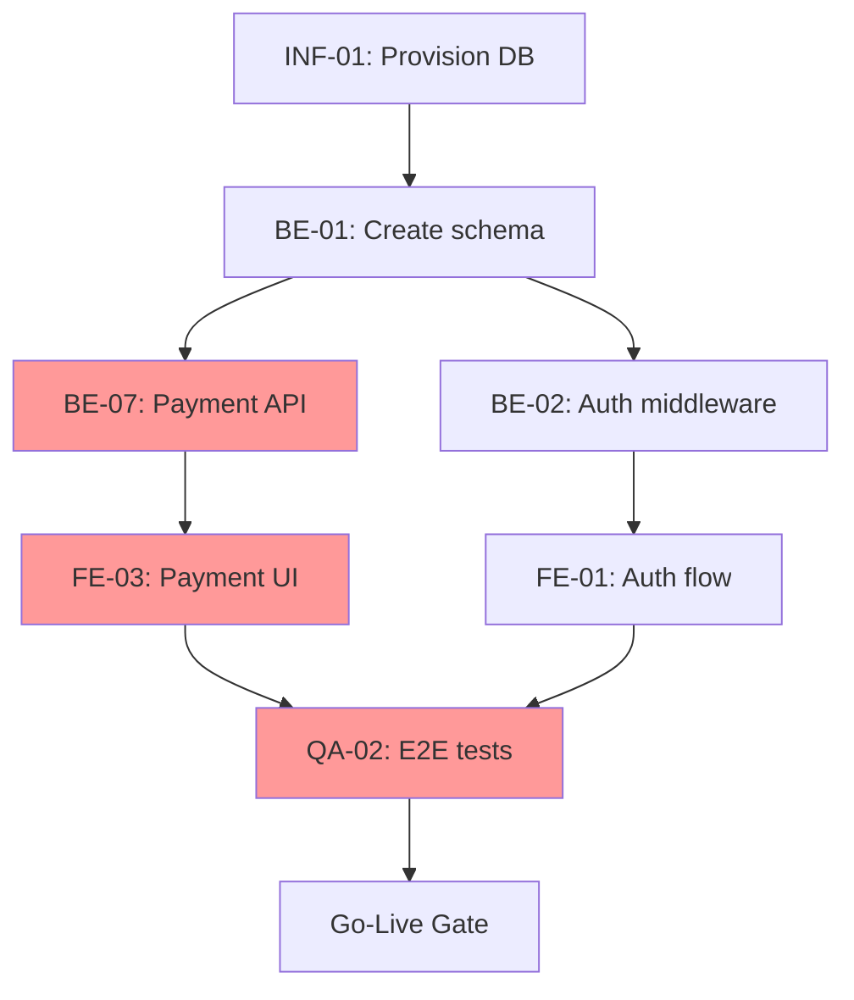

# Framework: dependency-mapper

Defines the methodology for inventorying, classifying, and visualizing engineering dependencies to identify the critical path and cross-team blockers.

## Dependency Classification

Classify every dependency edge before building the graph:

| Type | Definition | Consequence if Violated | Example |
|------|-----------|------------------------|---------|
| **Hard (Blocking)** | Task B cannot start until Task A is complete | Task B is blocked; timeline slips | API endpoint must exist before FE integration begins |
| **Soft (Preferred)** | Task B is better after Task A but can proceed in parallel | Merge conflicts, rework, or integration friction | Schema migration preferred before feature branch merges |
| **External** | Dependency on a team or system outside the project | Requires escalation path and SLA monitoring | Third-party API credential provisioning |
| **Circular (Design Defect)** | Task A depends on Task B which depends on Task A | Neither task can start; must be resolved architecturally | Two services each waiting for the other's API contract |

Circular dependencies are design defects — never represent them as constraints to manage. They must be resolved before mapping is considered complete.

## Mapping Process

### Step 1: Task Inventory Format

Capture for each task:
```
Task ID: [team prefix]-[sequential number]  e.g., BE-07
Owner team: Backend / Frontend / Infrastructure / QA / External
Duration: [N days]
Status: Not started / In progress / Complete / Blocked
```

### Step 2: Dependency Edge Identification

For each task, ask two questions:
- **"What must be complete before this task can start?"** → `DEPENDS-ON` edges
- **"What cannot start until this task is complete?"** → `BLOCKS` edges

Record every edge with its type (Hard / Soft / External).

### Step 3: Critical Path Calculation (CPM)

The critical path is the longest chain of hard dependencies. Use the forward-pass method:

```
For each task, earliest start = MAX(completion time of all hard predecessors)
Critical path = chain of tasks where earliest start = latest start (zero float)
```

If using a project tool: export the Gantt or task dependency graph and identify the longest unbroken chain of hard dependencies.

**Float**: Tasks off the critical path have float (slack). Float = latest start − earliest start. Use float to identify where parallel work is safe.

### Step 4: Cross-Team Boundary Detection

Flag every dependency edge that crosses a team boundary:
- Assign a **requesting owner** (the blocked team) and a **providing owner** (the blocking team)
- Set an SLA for when the providing team must deliver (not "as soon as possible")
- Add to the cross-team blocker register

## DAG Representation

Use Mermaid syntax for text-based dependency graphs (renderable in GitHub, Notion, Linear):



Color conventions:
- Red: Critical path tasks
- Orange: Cross-team dependencies
- No color: Off-critical-path tasks

## Update Cadence

| Trigger | Action |
|---------|--------|
| Any task marked complete | Recalculate float and critical path; update downstream task status |
| New task added | Add edges; re-run critical path calculation |
| Blocker resolved | Remove blocking edge; reassign task to new owner if needed |
| Scope change | Re-run full mapping exercise for affected workstream |
| Weekly (standing) | Review graph for stale edges (tasks marked complete but edges not removed) |

## Common Dependency Antipatterns

| Antipattern | Detection Signal | Fix |
|-------------|-----------------|-----|
| God task | One task has > 5 blocking relationships | Decompose the task into smaller deliverable units |
| Undocumented shared resource | Two tasks modify the same file, table, or config without a dependency edge | Add a soft dependency; consider restructuring to reduce coupling |
| External dependency without SLA | `EXT-DEP` edge with no committed date | Request a written commitment from the external team or vendor |
| Implied dependency | Teams informally agreed to sequencing but it's not in the dependency map | Formalize as a hard or soft edge in the map |
